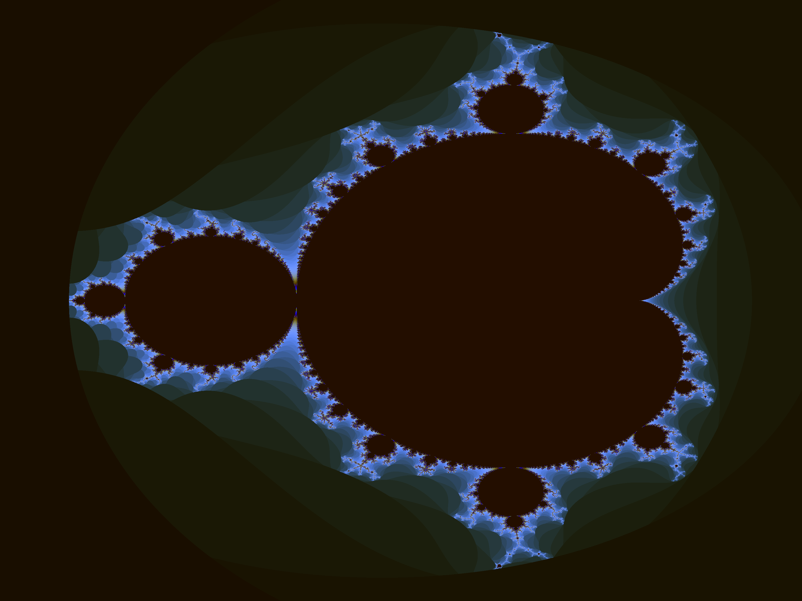

# Vulkan Minimal Compute

This is a simple demo that demonstrates how to use Vulkan for compute operations only.
In other words, this demo does nothing related to graphics, 
and only uses Vulkan to execute some computation on the GPU.
For this demo, Vulkan is used to render the Mandelbrot set on the GPU. The demo is very simple, 
and is only ~400LOC. **The code is heavily commented, so it should be useful for people interested in learning Vulkan**.

The only depdendencies are Vulkan and `lodepng`. `lodepng` is simply used for png encoding. Vulkan can be installed
from `lunarg.com`

# Demo

The application launches a compute shader that renders the mandelbrot set, by rendering it into a storage buffer.
The storage buffer is then read from the GPU, and saved as `.png`. Check the source code comments
for further info.

## Building

The project uses CMake, and all dependencies are included, so you
should use CMake to generate a "Visual Studio Solution"/makefile,
and then use that to compile the program. If you then run the program,
a file named `mandelbrot.png` should be created. This is a Mandelbrot
set that has been rendered by using Vulkan. 
